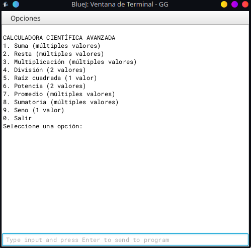

# Proyecto Calculadora

## Nombre del equipo
Team CALCULATOR-3000  
Integrantes: 
KNOWLES, 2CONDE2, Sentinela1209, Oliverbohorquez

## GitFlow utilizado
Se utilizó una variante del modelo GitFlow con las siguientes características:
- Rama main protegida: contiene la versión estable del proyecto.
- Rama develop: integra funcionalidades listas para producción.
- Ramas feature/nombre: para cada nueva funcionalidad o módulo.
- Ramas fix/nombre: para solucionar errores identificados.
- Pull Requests usados para revisión entre compañeros.

## Bitácora del mini-proyecto
Durante el desarrollo del proyecto se aplicó el flujo GitFlow. Las experiencias fueron:

- ✅ Facilidad para dividir tareas y evitar pisarse el trabajo.
- ⚠️ Problema: Se generó un conflicto entre la rama de 2CONDE2 y la de KNOWLES al modificar la misma rama. El conflicto fue generado por KNOWLES al actualizar una rama en la cual estaba trabajando 2CONDE2.
- ✅ El conflicto fue resuelto con una revisión conjunta durante la integración.
- 👍 GitFlow fue útil para organizar el trabajo, aunque al principio hubo confusión sobre cuándo hacer merge a develop.

## Evaluación de buenas y malas prácticas

- KNOWLES sobre 2CONDE2:
  - Buenas prácticas: commits descriptivos y frecuentes.
  - Malas prácticas: trabajar directo en develop sin feature branch en una ocasión.

- 2CONDE2 sobre KNOWLES:
  - Buenas practicas: nombres claros de las ramas.
  - Malas practicas: dejarse influenciar por el ego haciendo grandes avences sin usar commits.
  

## Alias y hooks utilizados
- Alias creado:
  - git lg = git log --oneline --graph --decorate
- Git Hook:
  - pre-commit: script que previene commits si hay errores de sintaxis en los archivos .java

## Documentación de ejercicios
La carpeta documentacion contiene:

1. flujo_trabajo.md – ejercicios sobre GitFlow y ramas
2. buenas_practicas.md – buenas prácticas y .gitignore
3. deshacer_cambios.md – uso de revert, reset, y reflog
4. trucos_git.md – uso de alias, stash y hooks
>>>>>>> 33adb2230e3b8775119d7acc75683fc628831bfa

**Proyecto: Calculadora Básica con Interfaz Gráfica**

Este proyecto fue realizado como parte de un curso de Git y GitHub, con el objetivo de aplicar buenas prácticas de control de versiones, trabajo colaborativo y documentación de software. Se utilizó Visual Studio Code como entorno de desarrollo. 

Descripción del Proyecto

La calculadora fue desarrollada en varias etapas, incrementando progresivamente su funcionalidad y mejorando la experiencia del usuario

Etapa 1: Calculadora Básica por Consola

Se implementó una calculadora sencilla que permitía realizar operaciones básicas (suma, resta, multiplicación y división).

El programa trabajaba con dos números como entrada y mostraba los resultados directamente en la consola.

Etapa 2: Menú Interactivo por Consola

Se añadió un menú de opciones para que el usuario pudiera elegir la operación a realizar.

Aunque el programa seguía funcionando desde la consola, esta mejora facilitó su uso y organización.
 

Etapa 3: Interfaz Gráfica y Funciones Adicionales

Se implementó una interfaz gráfica de usuario (GUI) utilizando una librería adecuada para el lenguaje del proyecto.

Se añadieron nuevas funciones, como:

-Validación de entrada de datos.

-Historial de operaciones realizadas.

-Mejora visual de botones y estructura de  la ventana.

